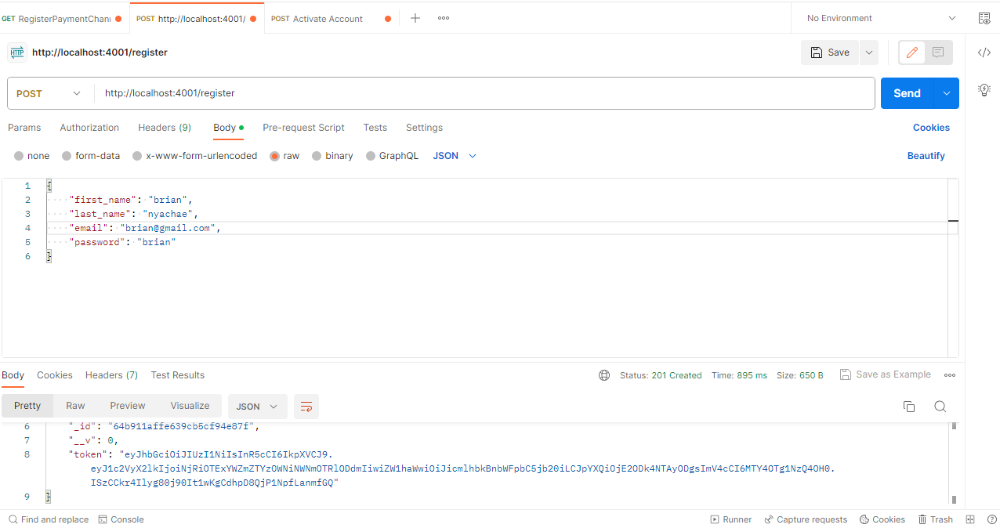
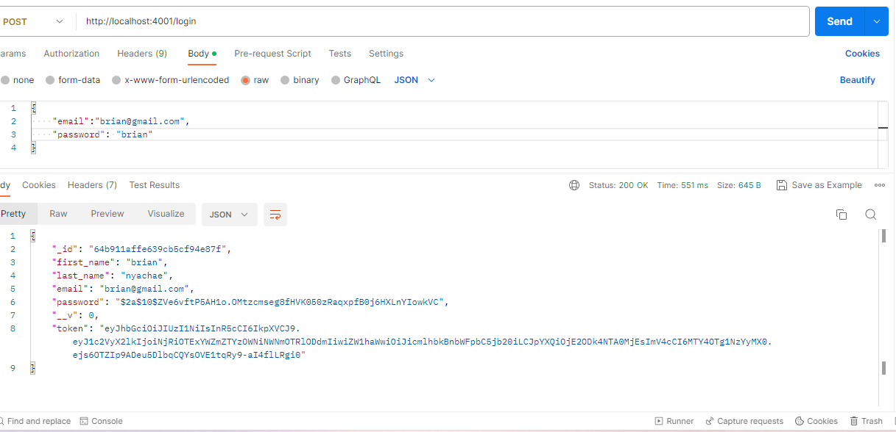
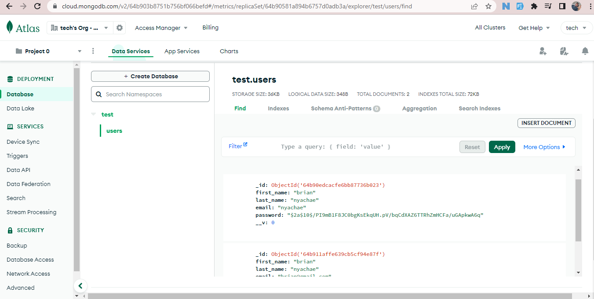

# Node js API authentication and authorization

> Description the project.
This project is a Node.js-based RESTful API built with Express and MongoDB, featuring JWT (JSON Web Tokens) for secure user authentication. The API allows users to register and login, storing encrypted passwords in the database. It leverages JWT to generate tokens for authenticated requests and provides access to protected routes based on the token's validity. The API's tech stack includes Node.js for its runtime environment, Express for web framework, MongoDB for data storage, and Bcrypt.js for password hashing. The API is ready to use, and contributions are welcome for enhancements and new features.
## Built With

- Javascript
- Nodejs, Expressjs,
- Technologies used

## Live Demo (if available)

[Live Demo Link](https://livedemo.com)

## Getting Started

**This is an example of how you may give instructions on setting up your project locally.**
**Modify this file to match your project, remove sections that don't apply. For example: delete the testing section if the currect project doesn't require testing.**

To get a local copy up and running follow these simple example steps.

### Prerequisites
- A working knowledge of JavaScript.
- A good understanding of Node.js.
- A basic understanding of MongoDB or any database of your choice.
- Postman and some knowledge on how to use Postman.
  
### Setup
1. clone the repository
2. install the dependencies

### Install
`npm install`
## Usage
` run the server nodemon run dev`
### register

`http://localhost:4001/register`

`{
    "first_name": "brian",
    "last_name": "nyachae",
    "email": "nyachae",
    "password": "brian"
}`

### Login

`http://localhost:4001/login`

`{

    "email": "nyachae",
    "password": "brian"

}`

## screenshots

### Register

### Login

### MangoDB data

### Deployment

## Authors

👤 **Author**

- GitHub: [@Bria222](https://github.com/Bria222)
- Twitter: [@briannyachae9](https://twitter.com/Briannyachae9)
- LinkedIn: [LinkedIn](https://linkedin.com/in/brian-nyachae)

## 🤝 Contributing

Contributions, issues, and feature requests are welcome!

Feel free to check the [issues page](../../issues/).

## Show your support

Give a ⭐️ if you like this project!

## Acknowledgments

- Hat tip to anyone whose code was used
- Inspiration
- etc

## 📝 License

This project is [MIT](./MIT.md) licensed.
